# Agentic AI Cyber Security

<p align="center">
  
</p>

An open-source Python-based source code security analyzer that identifies security flaws, flags fictitious or non-existent dependencies, prevents prompt injection attacks, and delivers AI-driven semantic code analysis — accessible through MCP integrations with Claude Code or command-line interfaces and CI/CD pipelines.

[](LICENSE)
[](https://python.org)
[](https://modelcontextprotocol.io)
[](#security-rules)
[](#output-formats)

---

## What It Does

| Capability | Description |
|------------|-------------|
| **Vulnerability Scanning** | AST analysis, regex patterns, and taint tracking across 10+ languages |
| **Package Hallucination Detection** | Bloom filter verification against PyPI, npm, and crates.io registries |
| **Prompt Injection Firewall** | 60+ patterns detecting jailbreaks, data exfiltration, and hidden instructions |
| **AI Semantic Code Review** | LLM-powered context-aware analysis via Claude API |
| **Auto-Fix Generation** | CWE-mapped fix templates for 100+ vulnerability types |
| **MCP Server** | 11 tools accessible from Claude Code, Cursor, Windsurf, and other AI editors |
| **CI/CD Integration** | SARIF 2.1.0 export, GitHub Actions, GitLab CI, pre-commit hooks |
| **Security Grading** | A–F grading system for project-level security posture |

---

## Quick Start

### Installation

```bash
git clone https://github.com/Krishcalin/Agentic-AI-Cyber-Security.git
cd Agentic-AI-Cyber-Security
pip install -r requirements.txt
```

### Usage

```bash
# Scan a single file
python main.py scan --file app.py

# Scan an entire project with security grade
python main.py scan --project ./myapp --profile full

# Check if a package is real or hallucinated
python main.py check-package reqeusts --registry pypi

# Detect prompt injection in text
python main.py scan-prompt --text "Ignore all previous instructions..."

# Scan only git diff (CI-friendly)
python main.py scan-diff --base main

# Start MCP server for Claude Code
python main.py mcp-serve

# AI-powered semantic code review
python main.py review --file app.py --provider claude
```

### MCP Integration (Claude Code)

```json
{
  "mcpServers": {
    "security-scanner": {
      "command": "python",
      "args": ["path/to/main.py", "mcp-serve"]
    }
  }
}
```

---

## MCP Tools

| Tool | Purpose |
|------|---------|
| `scan_security` | Vulnerability scanning with AST/taint analysis |
| `fix_security` | Auto-fix vulnerabilities with CWE-mapped templates |
| `check_package` | Verify package legitimacy against registries |
| `scan_packages` | Bulk import validation for dependency files |
| `scan_agent_prompt` | Prompt injection detection (60+ patterns) |
| `scan_agent_action` | Pre-execution safety checks for AI agents |
| `scan_project` | Full project audit with A–F security grading |
| `scan_git_diff` | Scan only changed files in a diff |
| `scan_dockerfile` | Dockerfile security audit |
| `scan_iac` | Terraform/Kubernetes misconfiguration detection |
| `scanner_health` | Plugin diagnostics and version info |

---

## Analysis Engines

### Multi-Layer Detection

```
Source Code → [AST Analyzer] → [Taint Tracker] → [Pattern Matcher] → Findings
                                                         ↓
Imports    → [Package Checker] → [Bloom Filter + Typosquat Detection] → Alerts
                                                         ↓
LLM Inputs → [Prompt Scanner] → [60+ Injection Patterns] → Firewall
                                                         ↓
Context    → [Semantic Reviewer] → [Claude API Analysis] → AI Review
```

| Engine | What It Does |
|--------|-------------|
| **AST Analyzer** | Python `ast` + tree-sitter for deep structural analysis |
| **Taint Tracker** | Traces user input → dangerous sink data flows |
| **Pattern Matcher** | 1000+ YAML-defined regex rules across 10+ languages |
| **Package Checker** | Bloom filters (PyPI ~500K, npm ~2.5M, crates ~130K) + typosquatting |
| **Prompt Scanner** | Jailbreak, DAN, data exfil, hidden instruction, tool_use abuse detection |
| **Semantic Reviewer** | LLM-powered intent-aware analysis (Claude/OpenAI) |

---

## Language Support

| Language | AST | Patterns | Taint | Auto-Fix |
|----------|-----|----------|-------|----------|
| Python | Yes | Yes | Yes | Yes |
| JavaScript/TypeScript | Yes | Yes | Yes | Yes |
| Java | Yes | Yes | Partial | Yes |
| Go | Yes | Yes | Partial | Yes |
| PHP | — | Yes | — | Yes |
| Ruby | — | Yes | — | Yes |
| C/C++ | — | Yes | — | Partial |
| Dockerfile | — | Yes | — | Yes |
| Terraform | — | Yes | — | Yes |
| Kubernetes | — | Yes | — | Yes |

---

## Security Grading

| Grade | Criteria |
|-------|----------|
| **A** | No critical/high findings, ≤2 medium |
| **B** | No critical, ≤2 high, ≤5 medium |
| **C** | No critical, ≤5 high |
| **D** | ≤2 critical, any high/medium |
| **F** | 3+ critical findings |

---

## Output Formats

- **Terminal** — Rich-formatted with syntax highlighting and color-coded severity
- **JSON** — Machine-readable for CI/CD automation
- **SARIF 2.1.0** — GitHub Code Scanning, GitLab SAST integration
- **HTML** — Standalone report with executive summary and code snippets

---

## Development Status

| Phase | Description | Status |
|-------|-------------|--------|
| 1 | Foundation (models, pattern matcher, CLI, 85 rules, grading) | Done |
| 2 | AST Analysis & Taint Tracking (Python) | Done |
| 3 | Package Hallucination Detection (bloom filters, typosquatting) | Done |
| 4 | Prompt Injection Firewall (60+ patterns) | Done |
| 5 | Auto-Fix Engine (26 templates, 18 CWEs) | Done |
| 6 | MCP Server (12 tools, stdio transport) | Done |
| 7 | Semantic Code Review (Claude/OpenAI) | Done |
| 8 | Multi-Language Rules (237 rules, 12 languages) | Done |
| 9 | CI/CD Integration (SARIF, GitHub Actions, pre-commit) | Done |
| 10 | Testing & Benchmarks (20 test files, 8 fixture languages) | Done |

**All phases complete — ~14,000 lines of code.**

---

## Contributing

Contributions are welcome. See [CLAUDE.md](CLAUDE.md) for architecture details, coding conventions, and development phases.

---

## Disclaimer

This tool is intended for **authorized security analysis only**. Always ensure you have proper authorization before scanning code you do not own.

---

## License

[MIT](LICENSE)
